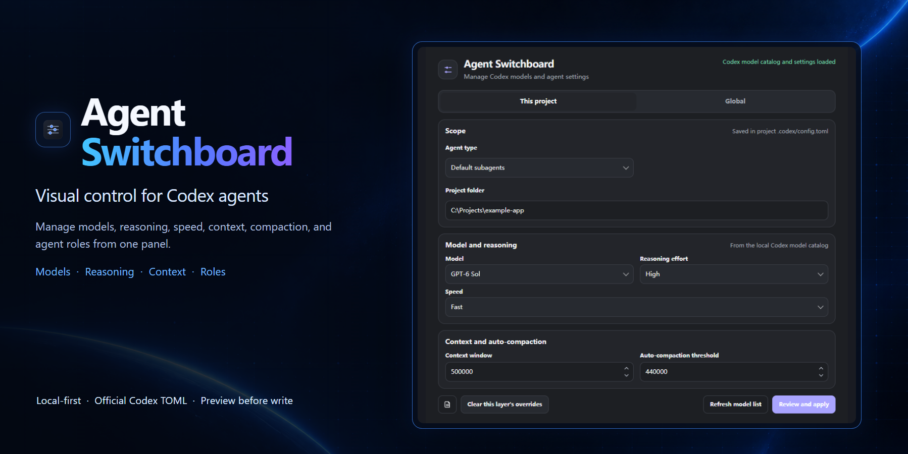
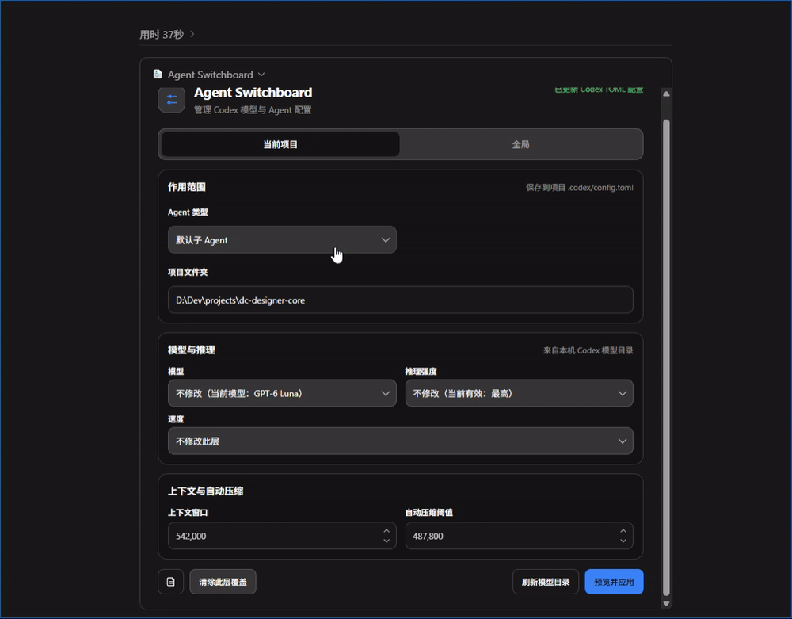
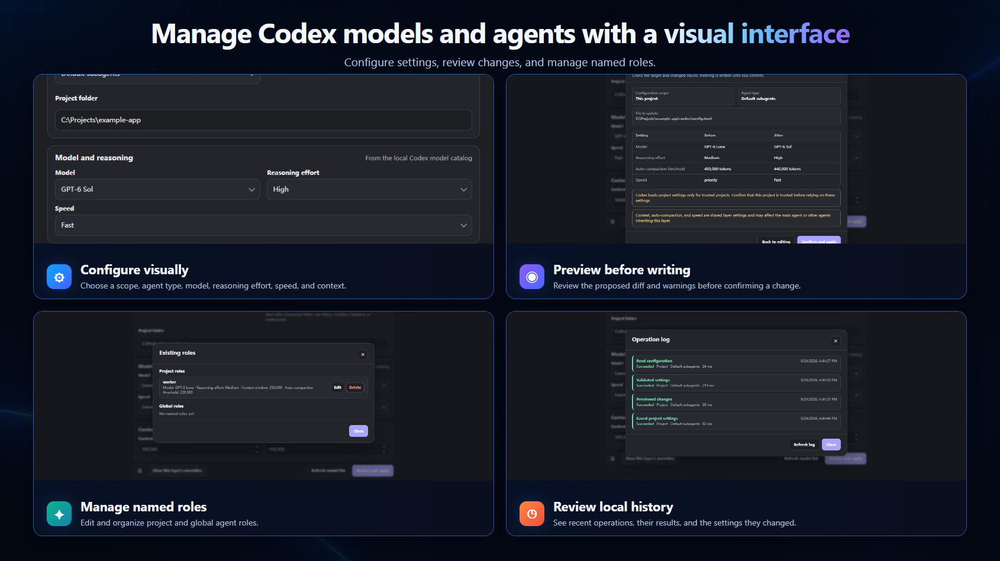

<h1 align="center">Agent Switchboard</h1>

<p align="center">
  <a href="README.en.md">English</a> · <a href="README.md">简体中文</a>
</p>

<p align="center">
  <a href="https://github.com/xiajiadi/agent-switchboard/releases/latest"></a>
  <a href="https://github.com/xiajiadi/agent-switchboard/actions/workflows/ci.yml"></a>
  <a href="LICENSE"></a>
</p>

## Visual control for Codex agents

Configure models, reasoning, speed, context, compaction, and agent roles without hand-editing TOML. Use the panel or ask Codex in natural language, then review changes before they reach Codex’s own configuration files.

[Install](#install) · [Full demo video](https://github.com/xiajiadi/agent-switchboard/releases/download/v0.1.0/agent-switchboard-demo.mp4) · [Technical guide](plugins/agent-switchboard/README.md) · [简体中文](README.md)

[v0.1.0 release](https://github.com/xiajiadi/agent-switchboard/releases/tag/v0.1.0)

[](https://github.com/xiajiadi/agent-switchboard/releases/download/v0.1.0/agent-switchboard-demo.mp4)

[](https://github.com/xiajiadi/agent-switchboard/releases/download/v0.1.0/agent-switchboard-demo.mp4)

*Click the GIF to open the full video demo.*

Local-first · Official Codex TOML · Preview before write

## Install

Add the GitHub-backed marketplace and install Agent Switchboard in Codex:

```bash
codex plugin marketplace add xiajiadi/agent-switchboard
codex plugin add agent-switchboard@agent-switchboard-community
```

Start a new Codex task after installation, then open **Agent Switchboard**. The local MCP server requires [uv](https://docs.astral.sh/uv/) and Python 3.11 or newer. The UI bundle is included; Node.js is only needed to rebuild it.

## Troubleshooting

- **The plugin does not appear after install:** Start a new Codex task, then open Agent Switchboard.
- **Project settings have no effect:** Confirm that the project is trusted in Codex. Codex reads project `.codex/config.toml` only for trusted projects.
- **The plugin fails to start:** Check that Python 3.11 or newer and `uv` are installed and available on your `PATH`.
- **The model list is outdated:** Select **Refresh model list** to reload the local Codex model catalog.

## Why Agent Switchboard?

| Editing TOML by hand | Using Agent Switchboard |
| --- | --- |
| Find the right global or project file and its precedence | Choose a scope and agent in the panel |
| Look up the right keys and model options | Pick from the model catalog available to your local Codex CLI |
| Check the edit, save, and recover manually | Preview, validate, review the diff, and confirm the write |

The plugin writes to Codex’s configuration files, so the same settings remain available to Codex without a separate settings store.

## Features

- **Visual configuration:** Set the scope, agent type, model, reasoning effort, speed tier, context window, and compaction threshold where supported.
- **Global and project scopes:** Manage user defaults or project overrides. Codex reads project configuration only for trusted projects.
- **Default subagent and named roles:** Configure default subagent settings and keep named role definitions in their own TOML files.
- **Natural-language workflow:** Ask Codex to inspect or update an agent. For example: “Set this project’s default subagent to GPT-6 Luna with high reasoning and Fast.”
- **Review before writing:** Validate supported values, inspect the proposed diff, and confirm before the plugin writes.
- **Local operation history:** Review recent operations and the settings they changed.
- **Native configuration:** Read and write Codex’s TOML files directly. Existing comments and unrelated settings are preserved.

<p align="center">
  
</p>

## Two ways to work

### Use the panel

Open Agent Switchboard, choose the scope and agent, adjust available settings, and select **Preview and apply**. Review the affected files and values before confirming.

### Ask Codex

You can describe the intended change in a prompt:

```text
For this project, set the default subagent to GPT-6 Sol with high reasoning.
Show me the proposed changes before applying them.
```

The plugin’s tools read the current configuration, validate requested values, and show a diff before writing.

## Scopes and configuration

| Scope | File | Use |
| --- | --- | --- |
| Global | `$CODEX_HOME/config.toml` | User-level defaults across projects |
| Project | `<project>/.codex/config.toml` | Overrides for one trusted project |
| Named role | A role-specific TOML file referenced by `agents.<name>.config_file` | Settings for a named agent role |

Codex controls which configuration layer takes effect. Command-line options and higher-precedence settings may override values from these files. Model, reasoning, and speed controls for the main agent remain in Codex’s model picker; the panel can manage supported context and compaction settings for the main agent.

## Safe writes, local data

The plugin validates the selected changes, shows a diff, and waits for confirmation. It preserves TOML comments and unrelated fields, then writes through an atomic file replacement. Operation history is stored locally at `$CODEX_HOME/logs/agent-switchboard.jsonl`.

The plugin has no built-in telemetry or hosted service. Its logs can contain local paths and values for settings managed by the plugin. Review [PRIVACY.md](PRIVACY.md) before sharing logs, and redact local details from public reports.

## Development

The installable plugin lives in [`plugins/agent-switchboard`](plugins/agent-switchboard). From that directory:

```bash
uv sync --locked
uv run python -m unittest discover -s tests -v
npm ci
npm run build:ui
```

The last two commands rebuild the bundled UI and require Node.js 20 or newer. See [CONTRIBUTING.md](CONTRIBUTING.md) for the development workflow and [the technical guide](plugins/agent-switchboard/README.md) for tools, configuration details, and local development installation.

## Contributing and support

- Report bugs or request features through [GitHub Issues](https://github.com/xiajiadi/agent-switchboard/issues).
- Ask setup questions and share feedback in [GitHub Discussions](https://github.com/xiajiadi/agent-switchboard/discussions).
- Read [CONTRIBUTING.md](CONTRIBUTING.md) before opening a pull request.
- For security issues, follow [SECURITY.md](SECURITY.md).
- See [SUPPORT.md](SUPPORT.md) for support details.

## License

Agent Switchboard is available under the [MIT License](LICENSE).
