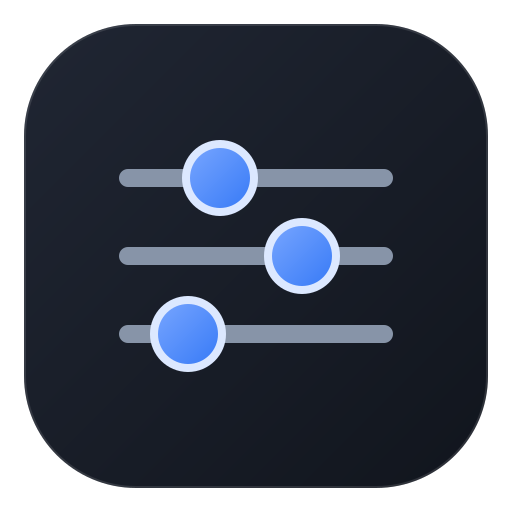

# Agent Switchboard

  

Agent Switchboard is a local Codex plugin for reviewing and managing Agent settings through a visual panel or natural-language tools.

It writes to Codex's official TOML configuration files. It does not keep a second settings database.

## Features

- Configure global defaults in CODEX_HOME/config.toml or project overrides in .codex/config.toml.
- Manage the default subagent and named agent roles.
- Select models, reasoning effort, speed, context window, and automatic compaction threshold.
- Preview and validate changes before confirming writes.
- Review operation history, including the affected configuration path and managed values.
- Keep role definitions in role-specific TOML files.

The plugin reads the model catalog available to the local Codex CLI. Codex only loads project-level configuration for trusted projects.

## Install from this GitHub marketplace

In Codex, add this marketplace and install the plugin:

    codex plugin marketplace add xiajiadi/agent-switchboard
    codex plugin add agent-switchboard@agent-switchboard-community

Then start a new Codex task and open **Agent Switchboard**. The plugin launches a local MCP server and needs uv plus Python 3.11 or newer. The prebuilt UI bundle is included; Node.js is only needed when rebuilding the UI from source.

To check the installed version:

    codex plugin list

## Build and verify from source

From plugins/agent-switchboard:

    uv sync --locked
    uv run python -m unittest discover -s tests -v
    npm ci
    npm run build:ui

The Node build regenerates agent_switchboard/ui_bundle.js from ui/src/app.js.

## Data and privacy

The plugin runs locally. It reads and writes the Codex TOML files selected in the panel and stores its operation history under CODEX_HOME/logs/agent-switchboard.jsonl. Log details can include local paths and values for settings managed by the plugin. The plugin has no built-in telemetry or hosted service.

Review PRIVACY.md before sharing logs. Never attach a complete Codex configuration file or unredacted logs to a public issue.

## Repository layout

    .agents/plugins/marketplace.json     GitHub marketplace definition
    plugins/agent-switchboard/            Installable Codex plugin
    .github/workflows/ci.yml              Build and test checks

## Help and contributions

- Read the plugin's full guide: plugins/agent-switchboard/README.md.
- Report bugs and suggest changes through GitHub Issues.
- See CONTRIBUTING.md before opening a pull request.
- For security reports, follow SECURITY.md.

## 中文说明

Agent Switchboard 是一个本地 Codex 插件，通过可视面板和自然语言工具管理 Agent 配置。它直接编辑 Codex 官方 TOML 文件，不另存一份私有配置。

### 主要功能

- 管理全局默认配置和项目级覆盖
- 设置默认子 Agent 与命名角色
- 选择模型、推理强度、速度、上下文窗口和自动压缩阈值
- 写入前预览并校验修改
- 查看操作日志、配置路径和本插件管理的配置值

项目级配置只有在 Codex 信任该项目时才会读取。

### 安装

在 Codex 中添加 GitHub 市场并安装：

    codex plugin marketplace add xiajiadi/agent-switchboard
    codex plugin add agent-switchboard@agent-switchboard-community

安装后新建一个 Codex 任务，再打开 **Agent Switchboard**。插件在本机启动 MCP 服务，需要安装 uv 和 Python 3.11 或更新版本。仓库已包含构建好的 UI；只有从源码重新构建界面时才需要 Node.js。

### 数据处理

插件在本机运行。它读取和写入面板中选择的 Codex TOML 配置，并将操作历史保存在 CODEX_HOME/logs/agent-switchboard.jsonl。日志详情可能包含本机文件路径和插件管理的配置值。插件没有内置遥测或托管服务。公开反馈前请先阅读 PRIVACY.md，不要上传完整配置或未脱敏日志。

### 开发

进入 plugins/agent-switchboard 后，按上面的构建和验证命令操作。更多用法见插件说明。

## License

This project is licensed under the MIT License. See LICENSE.