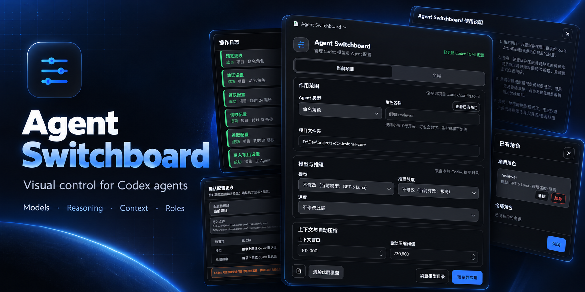
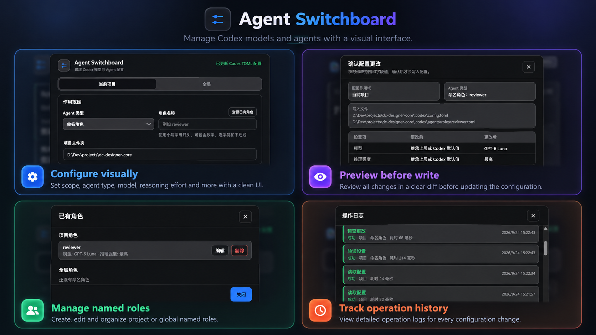

# Agent Switchboard

[English](README.md) · [简体中文](README.zh-CN.md)

[](https://github.com/xiajiadi/agent-switchboard/actions/workflows/ci.yml)
[](LICENSE)

## 用可视面板配置 Codex Agent

不用手改 TOML，即可管理模型、推理强度、速度、上下文、自动压缩和 Agent 角色。你可以操作面板，也可以直接用自然语言告诉 Codex 要改什么；写入前都能查看变更。

[安装](#安装) · [观看演示](assets/agent-switchboard-demo.mp4) · [技术说明](plugins/agent-switchboard/README.md) · [English](README.md)

[v0.1.0 发布说明](docs/releases/v0.1.0.md)

[](assets/agent-switchboard-demo.mp4)

*点击图片可打开录制演示。*

本地运行 · 使用 Codex 官方 TOML · 写入前预览

## 安装

在 Codex 中添加 GitHub 插件市场并安装 Agent Switchboard：

```bash
codex plugin marketplace add xiajiadi/agent-switchboard
codex plugin add agent-switchboard@agent-switchboard-community
```

安装后新建一个 Codex 任务，再打开 **Agent Switchboard**。本地 MCP 服务需要安装 [uv](https://docs.astral.sh/uv/) 和 Python 3.11 或更新版本。仓库已包含构建好的界面；只有重新构建时才需要 Node.js。

## 为什么用 Agent Switchboard

| 手动编辑 TOML | 使用 Agent Switchboard |
| --- | --- |
| 查找全局或项目文件，并确认配置优先级 | 在面板中选择作用域和 Agent 类型 |
| 查询字段与模型选项 | 从本机 Codex CLI 提供的模型目录中选择 |
| 手动检查、保存和恢复 | 先预览、校验和查看差异，确认后再写入 |

插件直接编辑 Codex 配置文件。设置仍由 Codex 读取，不需要另建一套配置存储。

## 功能

- **可视化配置：** 按支持范围设置作用域、Agent 类型、模型、推理强度、速度、上下文窗口和自动压缩阈值。
- **全局和项目作用域：** 管理用户默认值或项目覆盖。Codex 只读取受信任项目中的项目配置。
- **默认子 Agent 和命名角色：** 配置默认子 Agent，并将命名角色保存在各自的 TOML 文件中。
- **自然语言操作：** 直接告诉 Codex 要检查或修改什么，例如：“把当前项目的默认子 Agent 设为 GPT-6 Luna、高推理强度和 Fast。”
- **写入前审阅：** 校验支持的值、查看拟议差异，并确认后写入。
- **本地操作记录：** 查看最近操作及其修改的设置。
- **使用原生配置：** 直接读写 Codex TOML，保留已有注释和无关设置。

<p align="center">
  
</p>

## 两种使用方式

### 使用面板

打开 Agent Switchboard，选择作用域和 Agent，调整可用设置，然后点击“预览并应用”。确认前检查受影响的文件和配置值。

### 用自然语言告诉 Codex

例如：

```text
把当前项目的默认子 Agent 设为 GPT-6 Sol 和 high 推理强度。
应用前先展示拟议的改动。
```

插件会读取现有配置、校验请求的值，并在写入前显示差异。

## 作用域与配置

| 作用域 | 文件 | 用途 |
| --- | --- | --- |
| 全局 | `$CODEX_HOME/config.toml` | 跨项目的用户默认值 |
| 项目 | `<project>/.codex/config.toml` | 单个受信任项目的覆盖值 |
| 命名角色 | 由 `agents.<name>.config_file` 指定的角色 TOML 文件 | 命名 Agent 角色的设置 |

最终生效的配置由 Codex 的优先级规则决定。命令行参数和更高优先级的设置可能覆盖这些文件中的值。主 Agent 的模型、推理强度和速度仍在 Codex 模型选择器中调整；面板可管理主 Agent 支持的上下文和自动压缩设置。

## 安全写入与本地数据

插件会校验选定的修改、显示差异，并等待用户确认。它保留 TOML 注释和无关字段，再通过原子文件替换写入。操作记录保存在本机 `$CODEX_HOME/logs/agent-switchboard.jsonl`。

插件没有内置遥测或托管服务。日志可能包含本机路径和插件管理的设置值。分享日志前请阅读 [PRIVACY.md](PRIVACY.md)，发布问题时请先脱敏本机信息。

## 开发

可安装插件位于 [`plugins/agent-switchboard`](plugins/agent-switchboard)。进入该目录运行：

```bash
uv sync --locked
uv run python -m unittest discover -s tests -v
npm ci
npm run build:ui
```

最后两条命令会重新构建打包的界面，需要 Node.js 20 或更新版本。开发流程见 [CONTRIBUTING.md](CONTRIBUTING.md)；工具、配置细节和本地开发安装方式见[技术说明](plugins/agent-switchboard/README.md)。

## 参与和支持

- 通过 [GitHub Issues](https://github.com/xiajiadi/agent-switchboard/issues) 报告问题或提出功能建议。
- 提交 pull request 前请阅读 [CONTRIBUTING.md](CONTRIBUTING.md)。
- 安全问题请按 [SECURITY.md](SECURITY.md) 中的说明报告。
- 支持信息见 [SUPPORT.md](SUPPORT.md)。

## 许可证

Agent Switchboard 使用 [MIT 许可证](LICENSE)。
